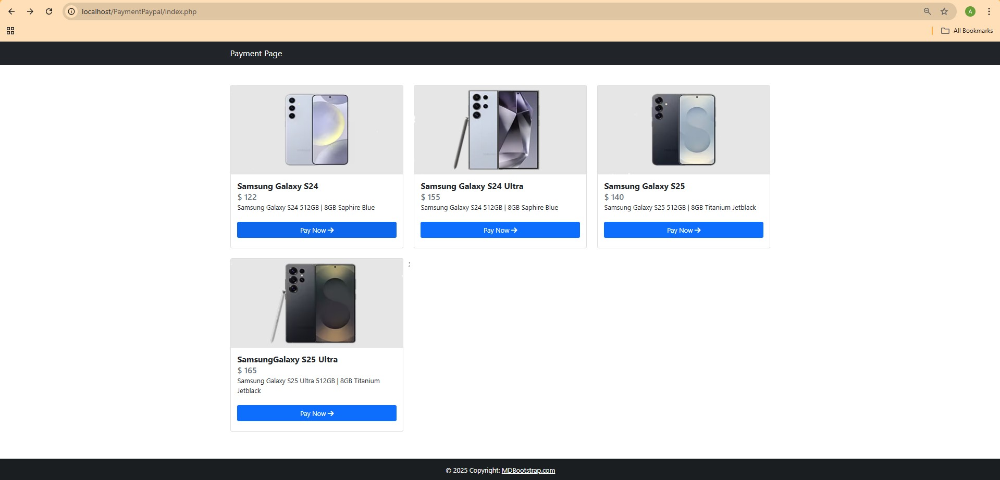

# PayPal Payment Page


## 📚 Table of Contents
- [Description](#description)
- [Features](#-features)
- [Technologies Used](#%EF%B8%8F-technologies-used)
- [How to Run](#%EF%B8%8F-how-to-run)
- [Documentation](#-documentation)

## Description
This project is an implementation of a payment page using the **PayPal API**. It allows users to make secure payments via PayPal with a simple and responsive interface


## ✨ Features  
- Integration with **PayPal Checkout** using **PayPal REST API**
- Display product details along with pricing
- Secure payment process directly through PayPal

## 🛠️ Technologies Used  
- **PHP** – Backend for payment processing
- **MySQL** – Store product and transaction data. 
- **HTML, CSS, Bootstrap** – Frontend design for the payment page
- **PayPal REST API** – Handles transaction processing

## ⚙️ How to Run
### Clone the Repository
1. Create folder with name PaymentPaypal inside htdoc XAMPP
2. Inside folder PaymentPaypal, clone this reposaitory :
   ```bash
   git clone https://github.com/adysaptr/Payment-Page-With-Paypal.git
   ```
4. Make sure this project have stucture like this :
   ```
   PaymentPaypal/
   │
   ├── config/
   │ └── config.php # Database & PayPal API configuration
   ├── images/
   │ └── image1.png
   │ └── image2.png
   │ └── image3.png
   ├── index.php # Homepage or product list page
   ├── pay.php # Main payment processing page
   ├── paymentpaypal.sql # SQL database
   └── README.md # Project documentation
   ```

### Import Database to Phpmyadmin
1. Open XAMPP Control Panel and start MySQL and Apache server
2. Use your browser to open phpmyadmin in localhost :
   ```bash
   http://localhost/phpmyadmin
   ```
3. In left side, create new database with name paymentpaypal, and click create
4. At "_Create new table_" section, select import in the top panel and chose **_paymentpaypal.sql_** in PaymentPaypal folder in your htdoc
5. CLick import and paymentpaypal database will be imported in your database
6. Make sure that there is a products table in the PayPal payment database

### Create Paypal REST API
1. Open [PayPal Developer Page](http://developer.paypal.com/) to get your REST API
2. SignUp/Login if you already have account
3. In tab "_**Apps & Credential**_" click create app and a dialog box will appear
4. AT App Name, yopu can cretae name like Payment or other you like it, For ttype, you can set to Merchant and Sandbox account will automatic filled
5. If you ready, click create
6. You akready have new App name in your  Developer Paypal Page, open it and you will see CLient ID
7. Copy your Clien ID Code and paste in file pay.php in line 84
8. Replace ### in code with your CLient ID Code

### Create Your Bussiness & Personal Account for Payment Simulation
1. At the developer paypal page, navigate to testing tools > sandbox account
2. Click create account and choose personal account
3. You will have a personal account and password that has $5000 credit for payment simulation
4. Do the same to create a business account
5. Open your personal account and you will see email like : sb-zfeig41527591@personal.example.com and password like : aTvaP*P7

### Payment Simulation
1. Open
   ```
   http://localhost/PaymentPaypal/index.php
   ```
2. Chose one product and click Pay Now, you will direct to paypal page
3. Product name, description, and price will be displayed in paypal page. Click pay with PayPal to payment
4. Insert your personal account and password to payment your product
5. Payment successfully

### Make Sure Success Payment
1. Open [Sandbox Paypal Page](https://sandbox.paypal.com/) to check your credit
2. Login and insert your personal account and password. Now, you can see yout credit, the initial credit is $5000, if it decreases it means you have made a payment according to the price of the product you paid for
3. Logout and login again use your bussiness account
4. The initial credit is $5000, if it increases it means there is a transaction that has entered your business account

## 📖 Documentation
1. Product page


2. Payment paypal page


4. Insert payment account


5. Confirm payment


6. Credit personal account


8. Credit bussiness account


## 🙏 Thank You
Thank you for visiting this repository! If this project is useful, don't forget to give it a ⭐ so that more people can find it.

Created with 💻 by [Ady Saputra](https://github.com/adysaptr
   
